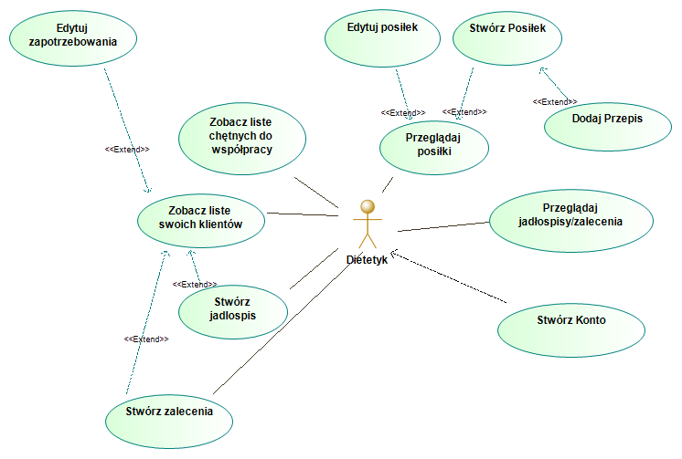
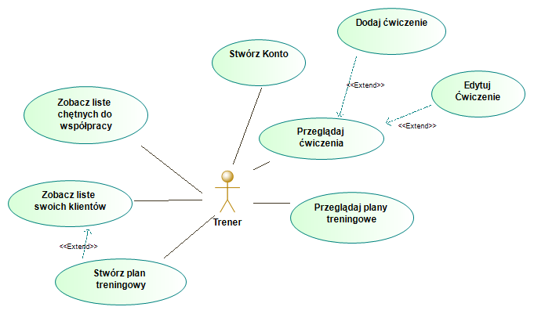
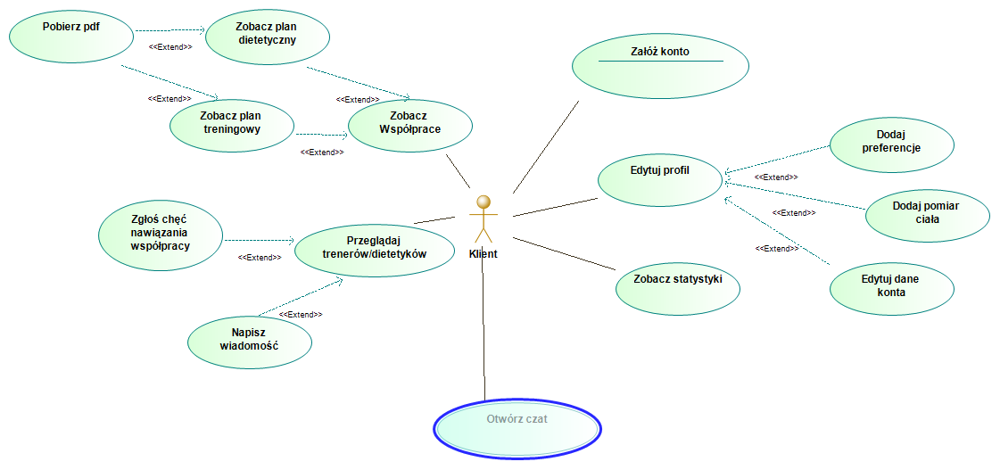
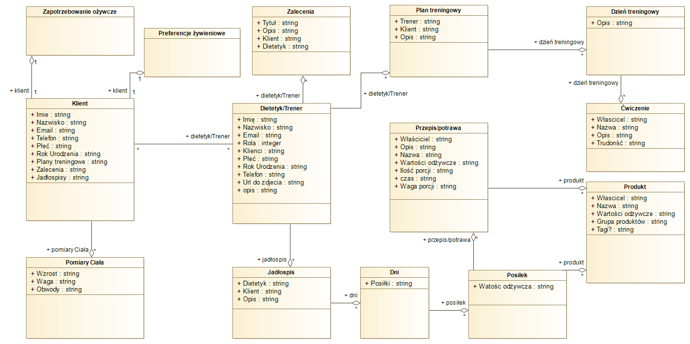

# Projekt: Aplikacja wspomagająca dietetyków

**Versja:** 1.0

**Autorzy:** Mateusz Kalata, Patryk Nowacki, Tomasz Stańczuk, Michał Gajda

**Data utworzenia:** 03.12.2020

**Data ostatniej modyfikacji:** 03.12.2020

---

## 1.   Wymagania

### 1.1.    Funkcjonalne
*   Aplikacja ma ułatwiać proces tworzenia jadłospisu.
*   Aplikacja ma ułatwiać proces tworzenia zaleceń dietetycznych.
*   Aplikacja ma ułatwiać proces tworzenia planów treningowych.
*   Aplikacja ma udostępniać bazę produktów i przepisów wraz z ich parametrami odżywczymi.
*   Aplikacja ma umożliwiać tworzenie spersonalizowanych profilów klienta oraz dietetyka.
*   Aplikacja ma umożliwiać nawiązywanie współpracy między klientami, a dietetykiem.
*   Aplikacja ma pozwalać na konwertowanie stworzonych jadłospisó, zaleceń i planów do formatu pdf.
### 1.2.    Niefunkcjonalne
*   Aplikacja ma przechowywać dane i hasła w sposób bezpieczny.
*   Ma być dotępna z poziomu przeglądarek Mozzilla, Google Chrome oraz Microsoft Edge.
*   Ma posiadać własną bazę danych
### 1.3.    Przypadki użycia
*   Dietetyk
    *   Stwórz jadlospis
    *   Stwórz zalecenia
    *   Zobacz liste swoich klientów
        *   Edytuj zapotrzebowania
    *   Przeglądaj jadłospisy/zalecenia
    *   Stwórz Konto
    *   Przeglądaj ćwiczenia
        *   Stwórz Posiłek
        *   Edytuj posiłek
    *   Zobacz liste chętnych do współpracy
    
---
*   Trener
    *   Zobacz liste chętnych do współpracy
    *   Stwórz plan treningowy
    *   Zobacz liste swoich klientów
    *   Przeglądaj plany treningowe
    *   Stwórz Konto
    *   Przeglądaj ćwiczenia
        *   Dodaj ćwiczenie
        *   Edytuj Ćwiczenie
        
    
---
*   Klient
    *   Zobacz Współprace
        *   Zobacz plan treningowy
        *   Zobacz plan dietetyczny
    *   Przeglądaj trenerów/dietetyków
        *   Napisz wiadomość
        *   Zgłoś chęć nawiązania współpracy
    *   Załóż konto
    *   Zobacz statystyki
    *   Edytuj profil
        *   Dodaj preferencje
        *   Dodaj pomiar ciała
        *   Edytuj dane konta
    
---
*   Administrator

### 1.4.    Stos technologiczny
*   ASP.NET API Controler
*   MySQL
*   React
    
---

## 2.   Architektura

#### Diagram dziedzinowy
Wstępny opis powiązań obiektów w aplikacji.

    
---

## 3.   Scrum
### 3.1.  Kamienie milowe
*   
### 3.2.  Zadania
*   
